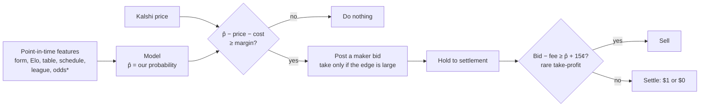

# Next chapter (v2): predict better, hold to settlement

**Goal:** make money by being **right more often than the price**, not by how we trade.
Buy only when our model's probability beats the price by enough, **hold to settlement**, and
sell early only in rare cases where the market overpays.

Why this, after v1.0 ([report](REPORT_v1.0.md)):
- Prices are accurate, so **the only edge left is information the price doesn't have yet**.
- Holding pays the fee **once**; trading pays the spread and fees twice.
- Posting orders cuts costs by about 3.5¢, so v2 posts orders first.

## The decision flow


*odds = bookmaker odds, if we start collecting them (currently paused).

## The bar a model must clear (in this order, before any money)

| Gate | Test | Pass |
|---|---|---|
| 1. **Beats the market's accuracy?** | On held-out games: Brier score and log loss of p̂ vs the market price | p̂ better, or at least… |
| 2. **Adds information?** | Regress the outcome on logit(market) + logit(p̂) | Model coefficient > 0 at 99%. **This is the key test**: a model can be worse than the market overall and still be useful blended in |
| 3. **Profitable when it disagrees?** | Pre-registered bets where p̂ − price − cost ≥ margin; hold to settlement | 99% interval of net ¢ per contract above 0, **≥ 50 bets**, beats random entry |
| 4. **Holds up forward?** | Paper trading, rules frozen | ≥ 30 days, ≥ 100 bets, same bar |

Gate 1 is hard: the market's own Brier score is what we measured in Finding 01. **Gate 2 is
where a real edge would first show up.**

## Roadmap

| Phase | What | Output |
|---|---|---|
| **0. Dataset** | One table: game × leg × entry time → point-in-time features, price, result. Leakage guard: no feature newer than the entry time. | `wc/research/dataset.py` + tests |
| **1. Baselines** | Market price (the benchmark to beat); Elo **recalibrated** (it was overconfident); Dixon-Coles Poisson; "market + small model nudge" | Gate 1–2 scorecard, one chart |
| **2. Where the market might be weak** | Split gates 1–2 by league tier (thin leagues), time to kickoff, early season, draws, schedule congestion | Where, if anywhere, the model adds information |
| **3. Betting rule** | Margin, fractional-Kelly size, maker-first order, the rare take-profit rule (bid − fee ≥ p̂ + 15¢) | A pre-registration doc like Batch 1 |
| **4. Test, then forward** | One test run, then paper trading | Pass or fail, reported like v1.0 |

## Decisions for Jack before Phase 0

1. **Data:** ✅ **laptop data only for now; no new collection** (Jack, 2026-09-28). The droplet's Kalshi store (~5× more Kalshi games) can be added to Table B later, if the model looks promising on Table A. Work happens on branch `feat/v2-dataset`.
2. **Bookmaker odds:** probably the strongest single predictor, and also the strongest benchmark. **Restart forward collection (#3), or find a historical source?**
3. **LLM as a predictor:** the desk-manager setup could produce a p̂ per game as one more input. Worth testing in Phase 1?

## Phase 0 in detail: the dataset (laptop data)

**One model, two tables:**

```
 TABLE A: learn + practice exam              TABLE B: final exam
 soccer.db, 2021 → 2026, ~54k matches        Kalshi legs, Jul → Sep 2026 (~2,200 games)
 features known BEFORE kickoff − 1h          same features, as of each entry time (24h / 6h / 1h)
 target: home / draw / away                  target: did this leg win
 benchmark: bookmaker odds (margin removed)  benchmark: Kalshi bid / ask / mid
```

- **Features are rebuilt in one forward pass over `matches`**, not read from `facts`:
  - `facts` stamps each value at the *end* of the match it came from (kickoff + 2h), holding the state *before* that match.
  - So a strict "known before the cutoff" rule would always be **one match stale**. Safe, but it loses the latest result.
  - Rebuilding is point-in-time by construction for **any** cutoff, and fully tested.
- **Features:**
  - Elo (both teams, difference, implied home probability)
  - matches seen, form (points per game, last 5)
  - goals and shots for/against (last 5)
  - home win rate at home / away win rate away
  - rest days
  - head-to-head (games, home side's win rate)
  - league draw rate and home win rate over the previous 365 days
- **Not features:** bookmaker odds and Kalshi prices. They are the benchmarks.
- **No-peek rule:** a match updates the state only once its result is known (`known_at` < cutoff). Ties go to the query, so a result known exactly at the cutoff is excluded. Tested.
- **Kalshi → soccer.db join:** same team-name matcher as the kickoff table, kickoff within ±36h. Unmatched and ambiguous games are counted and reported, never silently dropped.
- **Splits (fixed now):**
  - Table A: train 2021–2024 · tune 2025 · test Jan–May 2026 (bookmaker odds end 2026-05-13)
  - Table B: final exam, Jul–Sep 2026
- **Output:** `data/research/v2_dataset.db` (tables `ds_matches`, `ds_kalshi`), regenerable and gitignored.
- **First bars to beat:** leg Brier score of the base rates, the bookmaker (Table A) and Kalshi (Table B).
- **Open check:** the data lake keeps "the first bookmaker per fixture". Which bookmaker, and opening vs closing odds, are unknown.

## Settled: price-blind betting doesn't work ([Finding 07](findings/07_PRICE_VS_MODEL.md))

- Idea checked: "the model picks the winner and the stake; enter at any price".
- Profit per $ = model probability ÷ price − 1, so **the price is always in the answer**.
- Price and outcome are strongly related (market coefficient +1.30), and the Elo model added **nothing** once the price was known.
- **So the stake is set by the edge (p̂ − price), not by p̂ alone.**

## Rules carried over from v1.0

- Pre-register before testing; the git commit is the timestamp.
- Develop / test / forward split; 99% bar when several tests run at once; minimum sample sizes.
- Every chart regenerated from data; results pushed with short bullets.
