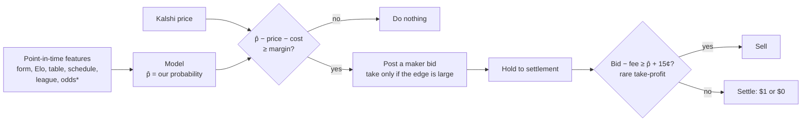

# Next chapter (v2): predict better, hold to settlement

**Goal:** make money by being **right more often than the price**, not by how we trade.
Buy only when our model's probability beats the price by enough, **hold to settlement**, and
sell early only in rare cases where the market overpays.

Why this, after v1.0 ([report](REPORT_v1.0.md)):
- Prices are accurate, so **the only edge left is information the price doesn't have yet**.
- Holding pays the fee **once**; trading pays the spread and fees twice.
- Posting orders cuts costs by about 3.5¢, so v2 posts orders first.

## The decision flow

*odds = bookmaker odds, if we start collecting them (currently paused).

## The bar a model must clear (in this order, before any money)

| Gate | Test | Pass |
|---|---|---|
| 1. **Beats the market's accuracy?** | On held-out games: Brier score and log loss of p̂ vs the market price | p̂ better, or at least… |
| 2. **Adds information?** | Regress the outcome on logit(market) + logit(p̂) | Model coefficient > 0 at 99%. **This is the key test**: a model can be worse than the market overall and still be useful blended in |
| 3. **Profitable when it disagrees?** | Pre-registered bets where p̂ − price − cost ≥ margin; hold to settlement | 99% interval of net ¢ per contract above 0, **≥ 50 bets**, beats random entry |
| 4. **Holds up forward?** | Paper trading, rules frozen | ≥ 30 days, ≥ 100 bets, same bar |

Gate 1 is hard: the market's own Brier score is what we measured in Finding 01. **Gate 2 is
where a real edge would first show up.**

## Roadmap

| Phase | What | Output |
|---|---|---|
| **0. Dataset** | One table: game × leg × entry time → point-in-time features, price, result. Leakage guard: no feature newer than the entry time. | `wc/research/dataset.py` + tests |
| **1. Baselines** | Market price (the benchmark to beat); Elo **recalibrated** (it was overconfident); Dixon-Coles Poisson; "market + small model nudge" | Gate 1–2 scorecard, one chart |
| **2. Where the market might be weak** | Split gates 1–2 by league tier (thin leagues), time to kickoff, early season, draws, schedule congestion | Where, if anywhere, the model adds information |
| **3. Betting rule** | Margin, fractional-Kelly size, maker-first order, the rare take-profit rule (bid − fee ≥ p̂ + 15¢) | A pre-registration doc like Batch 1 |
| **4. Test, then forward** | One test run, then paper trading | Pass or fail, reported like v1.0 |

## Decisions for Jack before Phase 0

1. **Data:** v1.0 used only the local store (~3,300 markets). A model needs more: **use the droplet's full store (~5×)?**
2. **Bookmaker odds:** probably the strongest single predictor, and also the strongest benchmark. **Restart forward collection (#3), or find a historical source?**
3. **LLM as a predictor:** the desk-manager setup could produce a p̂ per game as one more input. Worth testing in Phase 1?

## Rules carried over from v1.0

- Pre-register before testing; the git commit is the timestamp.
- Develop / test / forward split; 99% bar when several tests run at once; minimum sample sizes.
- Every chart regenerated from data; results pushed with short bullets.
