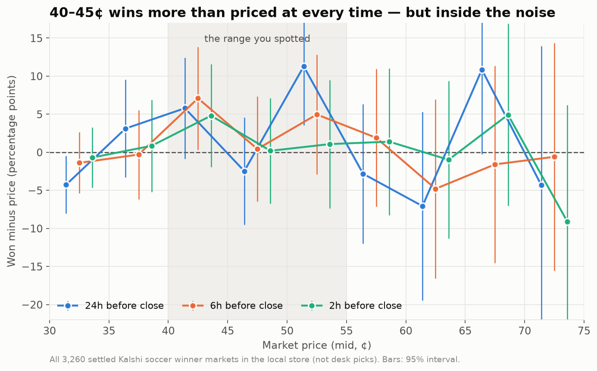
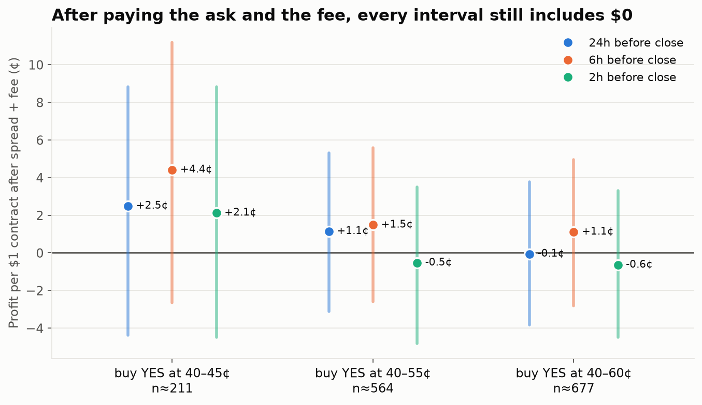
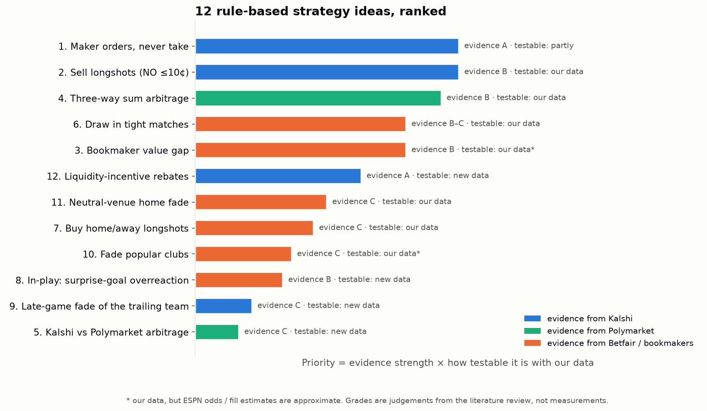
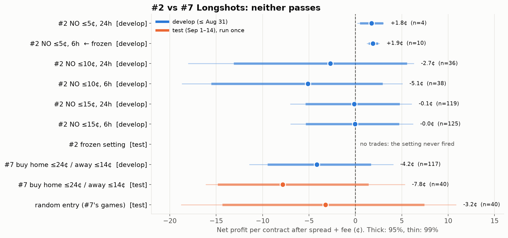
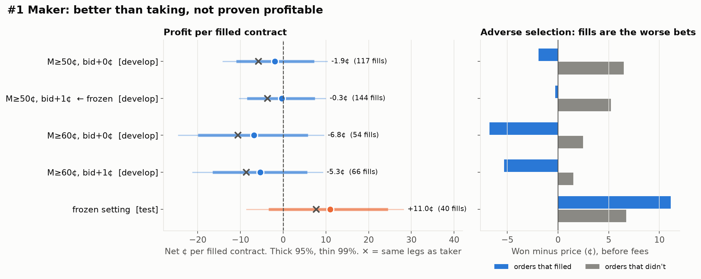
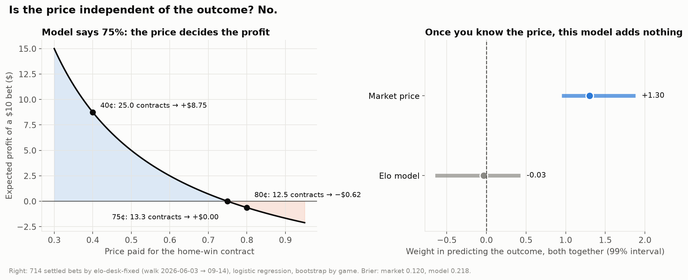

# Kalshi soccer — v1.0 research report

**Version 1.0.0 · 2026-09-28 · closes the "trading mechanics" chapter**

The question for this chapter: *can we make money on Kalshi soccer winner markets through how
we trade (timing, rules, order type, arbitrage), without a better prediction than the market?*

**Answer: no, not on the evidence we have.** Kalshi's prices are accurate probabilities. A
taker pays more to trade than prices move, and none of four pre-registered rule-based
strategies passed its test. The one consistent advantage (posting orders instead of taking
them) saves costs but doesn't create profit on its own.

**Next chapter (v2): win by predicting better, and hold to settlement.** See
[NEXT_CHAPTER_v2.md](NEXT_CHAPTER_v2.md).

---

## TL;DR in six bullets

1. **Prices are accurate probabilities.** Across 3,582 settled bets, the average price paid was 48.8¢ and the bets won 47.7% of the time.
2. **Every trading desk lost money,** AI-managed and rule-based alike. Doing nothing ($0) beat all of them.
3. **Prices barely move before kickoff:** about 1.5¢ over 24h. A taker round trip costs about 5.5¢.
4. **Taker fees close every arbitrage:** 24% of games dipped under $1 for all three outcomes before fees, and 0% did after.
5. **Pre-registered rules: 0 of 4 passed.** Longshot bias: none in either direction. Maker orders: +11¢ on 40 fills, but not significant.
6. **Makers beat takers by about 3.5¢ on the same bets.** Most soccer series charge makers no fee, but filled orders are the worse bets (adverse selection).

---

## What was built in this chapter

| Piece | Where | What it does |
|---|---|---|
| Walk-forward runner | `wc/firm/walk.py` | Steps desks through the season in ticks; resumable |
| AI desk managers | `wc/firm/manager.py` | One LLM call per desk per tick (OpenRouter) to hold or redesign the desk |
| Live dashboard | `wc/firm/dashboard.py` | `firm.html`, re-rendered while a walk runs |
| Engine fixes | `wc/backtest/engine.py` | Settlement during a walk; stranded stakes released (both had invalidated earlier backtests) |
| Kickoff dataset | `wc/research/kickoff.py` | ESPN = truth, Kalshi = check; `kickoffs` table |
| Pre-registered test runner | `wc/research/batch1.py` | Frozen rules; `test` refuses to run until the frozen values are committed |
| Charts | `scripts/*.py` | Every chart below is regenerated from data; no numbers typed in by hand |

Tests: 557 passing.

---

## 1. The AI desks and the benchmarks ([Finding 01](findings/01_MARKET_EFFICIENCY.md))

Five LLM-managed desks and five fixed benchmarks, $500 each, 53 two-day ticks (Jun 3 → Sep 14).


- The **blue line sits on the diagonal**: at every price from 5¢ to 95¢, win rate ≈ price.
- The **Elo model (orange) is badly overconfident**: when it said 43%, the team won 16% of the time.


- Every desk that traded lost money: **$1,772 in total, $425 of it fees.**
- The AI desks lost less than most benchmarks, mainly by learning to trade less.


- `desk-qwen` made **+$30 on bets held to settlement** and lost $76 selling early. This is the first hint behind the v2 idea: **hold, don't trade**.

## 2. Is 40–60¢ mispriced? ([Finding 02](findings/02_MIDRANGE.md))




- 40–45¢ won 5–7 points more often than priced, at every time checked, **but every interval crosses 0**.
- After the ask and the fee: +2 to +4¢, 95% interval about −4 to +11¢. Confirming it would take about 2,400 bets; we have 211.

## 3. How prices move before kickoff ([Finding 03](findings/03_PRICE_MOVES.md))


- Kalshi's `occurrence_datetime` is **kickoff + 3h**. ESPN matched 1,507 of 2,238 games.


- Typical move over the last 24h: **1.5¢**. A round trip costs **about 5.5¢**. Only 8% of markets move further than that.
- **Favourites (60¢+) drift up about 1¢** before kickoff. It's useful for **when** to buy, but it's not a strategy.

## 4. Literature review ([Finding 04](findings/04_STRATEGY_IDEAS.md))



- 12 rule-based ideas. The best Kalshi-specific evidence says makers beat takers.
- The citations were gathered by a research agent and are **not independently checked**.

## 5. Pre-registered tests, Batch 1 ([pre-registration](findings/05_PREREG_BATCH1.md) · [results](findings/06_BATCH1_RESULTS.md))

**Method:** rules and pass criteria were fixed before running. Develop on games through Aug 31
(808 games), then a single test run on Sep 1–14 (544 games). Passing requires the 99% interval
to be above 0 (five tests). The git commit of each frozen value is its timestamp.


| # | Strategy | Test-period result | Verdict | Why it failed |
|---|---|---|---|---|
| 4 | Buy all 3 outcomes under $1 | 0 of 860 games after fees | ❌ | **Fees** |
| 2 | Buy NO on longshots | the frozen setting never fired | ❌ | **Too few trades**; wider settings ≈ 0¢ |
| 7 | Buy home ≤24¢ / away ≤14¢ | −7.8¢ per contract, 40 bets | ❌ | **No edge** (lost before fees) |
| 1 | Resting bids on legs ≥50¢ | +11.0¢, 40 fills, 99% −8.6..+28 | ❌ | **Too few fills** + adverse selection |
| 3 | Bookmaker gap | — | paused | Needs forward odds collection |





---

## Addendum: can a model ignore the price? ([Finding 07](findings/07_PRICE_VS_MODEL.md))



- No. Profit per $ = model probability ÷ price − 1, and the price predicts the outcome strongly (+1.30) while the Elo model adds nothing beside it.

## What we learned

- **The price is the probability.** An edge has to come from knowing something the price doesn't, not from how we trade.
- **Fees decide everything for a taker:** about 1.75¢ at 50¢, charged on entry and again on exit.
- **Kalshi charges makers nothing on 85 of 91 soccer series.** The six top competitions charge a small fee.
- **Makers save about 3.5¢ per bet but get the worse fills.** Order type is a **cost** decision, not an edge.
- **Holding beats trading.** Selling before settlement pays the spread and a fee twice (Finding 01, Finding 03).
- **Sample size is the binding constraint.** Most "interesting" gaps need thousands of bets to confirm.
- **Pre-registration caught one of our own mistakes:** a selection rule allowed a 10-bet setting. Future rules require at least 50.

## Limitations (read before quoting any number)

- **Local data only:** about 3,300 settled markets, hourly bars. The droplet has about 5× more; the chapter deliberately didn't use it.
- **Hourly bars miss anything that lasts seconds:** brief arbitrages, and exact fills.
- **Fees:** today's schedule (from Kalshi's `/series` API), applied back to July–September. The maker coefficient 0.0175 comes from secondary sources.
- **Kickoff coverage:** 67% of games. Lower leagues are under-represented.
- **Backfill survivorship:** the archive only includes markets Kalshi still lists.
- **Literature citations:** not independently verified.

## Reproduce

```bash
python -m wc.research.kickoff                       # kickoff table (cached API responses)
python scripts/findings_charts.py data/walks/20260922_1905
python scripts/finding02_midrange.py
python scripts/finding03_moves.py
python scripts/strategy_map.py
python scripts/prereg_split_chart.py
python -m wc.research.batch1 three-way
python -m wc.research.batch1 longshot develop && python -m wc.research.batch1 longshot test
python -m wc.research.batch1 maker develop && python -m wc.research.batch1 maker test
python scripts/batch1_charts.py
```
