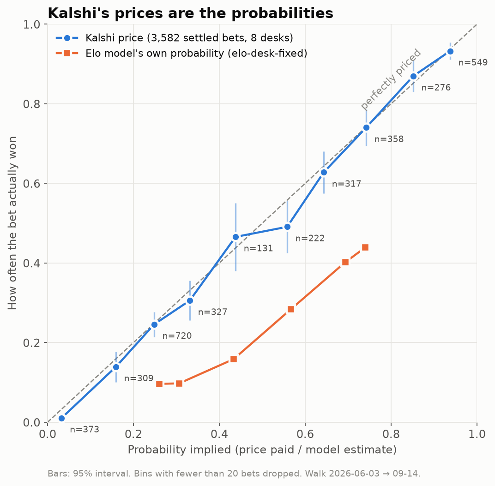
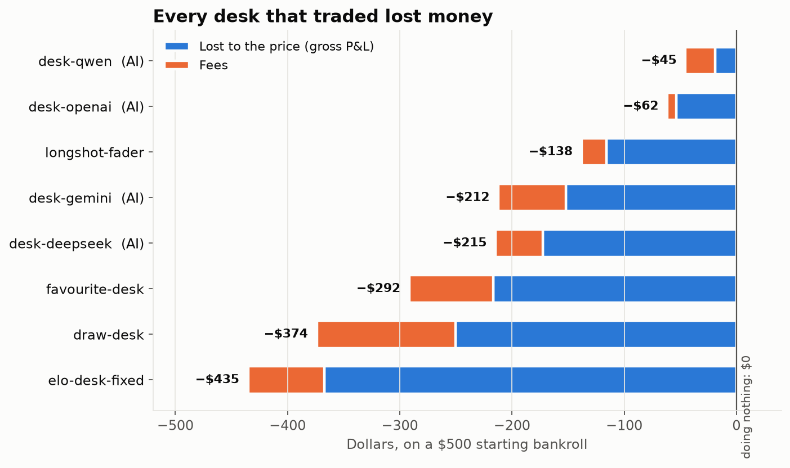
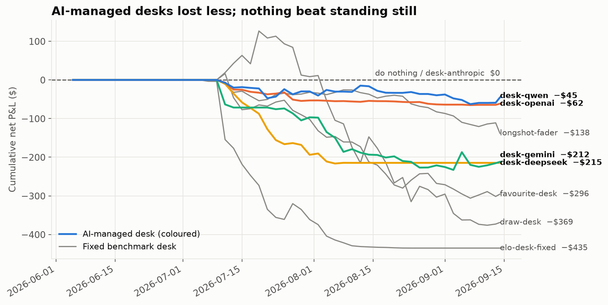
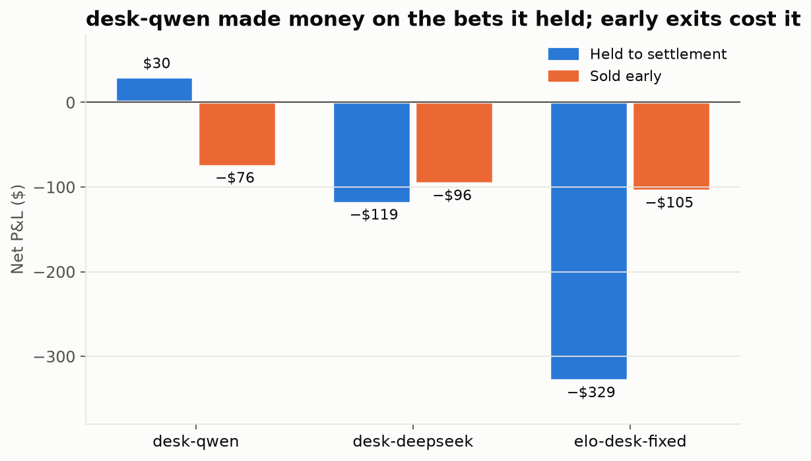

# Finding 01 — Kalshi soccer prices are close to efficient

**Run:** `data/walks/20260922_1905`: walk-forward, 2026-06-03 → 2026-09-14, 53 two-day ticks,
10 desks with $500 each: 5 managed by an LLM (via OpenRouter) and 5 fixed benchmarks.
**Charts:** `venv/bin/python scripts/findings_charts.py data/walks/20260922_1905`.

## Headline

Across **3,582 bets held to settlement** by 8 different desks, the average price paid was
**48.8¢**, and the bets won **47.7%** of the time. Kalshi's price already is the probability.
Every desk that traded lost money: $1,772 in total, $425 of it fees. Not trading ($0) beat
all of them.

## 1. Price ≈ probability

Bets are grouped by the price paid. Each group's win rate sits on the diagonal, within the 95%
interval, at every price level from 5¢ to 95¢. A market whose prices are probabilities looks
exactly like this. For contrast, the Elo model (orange) is far below the diagonal: when it said
43%, the team won 16% of the time. A desk trusting that model bought overpriced longshots.

## 2. Where the money went

Blue is what the bets lost against the price. That is mostly the bid/ask spread, because every
desk buys at the ask. Orange is Kalshi's fee. Neither is an edge the market gave away. The
benchmarks ignore price entirely ("always buy the favourite / the draw"), so they show the
cost of trading with no skill.

## 3. Over time

The AI-managed desks (coloured) lost less than every fixed benchmark apart from
`longshot-fader`. That is mostly because they learned to trade less, narrowing to one league or
stopping altogether. `desk-anthropic` never traded; that is a bug still under investigation,
not a decision.

## 4. The one hint of skill

`desk-qwen` was **+$30 on bets held to settlement** and lost $76 selling positions early. Its
exit rules, not its entries, cost it the run. With 126 settled bets the ±2–4 point margin of
error on a win rate is wider than any realistic edge, so this could be luck.

## What this does and doesn't show

- **Does:** a desk that *takes* liquidity using *public* information (Elo, form, prices) has no
  measurable edge on Kalshi soccer winner markets after spread and fees.
- **Doesn't:** rule out a small edge (the sample is too small), or say anything about
  *making* liquidity (resting orders earn the spread instead of paying it), thin leagues, or
  news-speed strategies. None of those were tested.

## Next

1. Why `desk-qwen`'s early exits lose, and whether holding to settlement is better.
2. Check that fills are realistic (entry at the ask vs the mid-price).
3. A maker-fill simulation in the backtester.
4. Results by league: thin markets may be less efficient.
