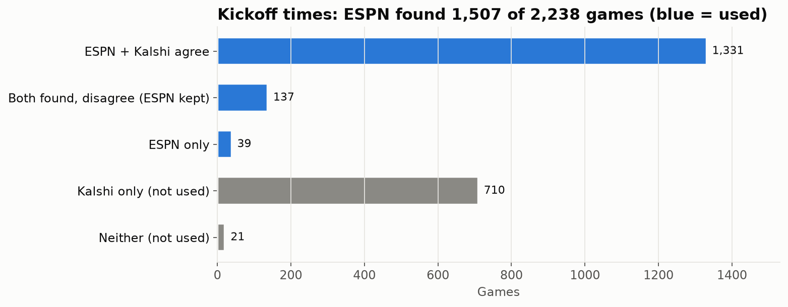
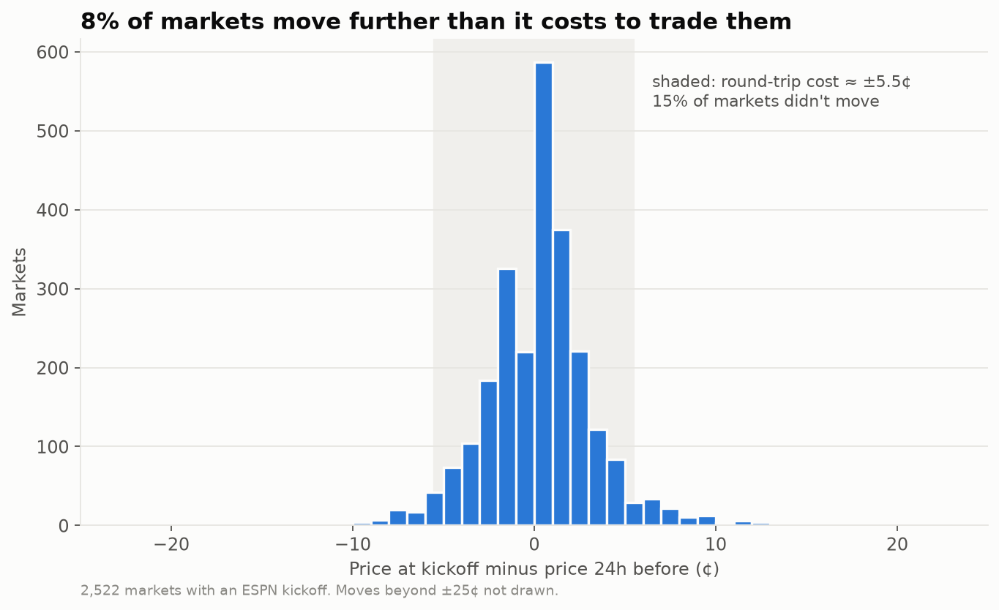
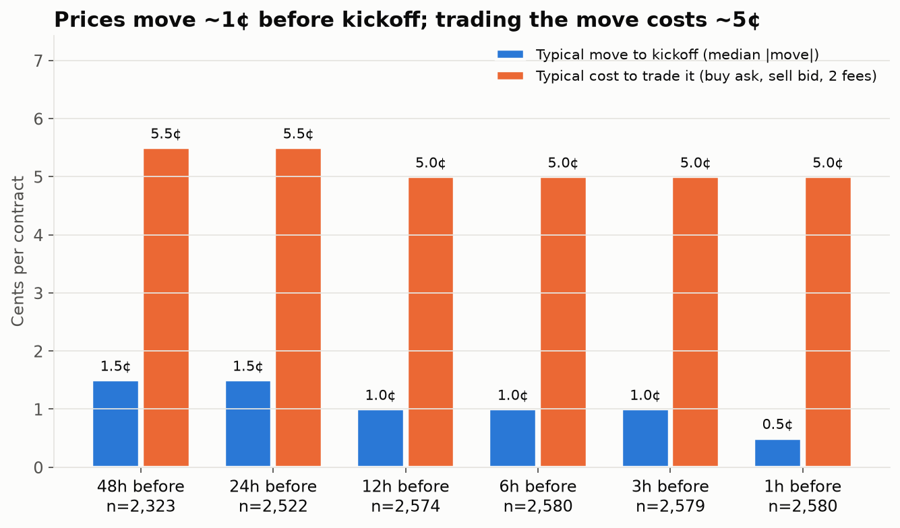
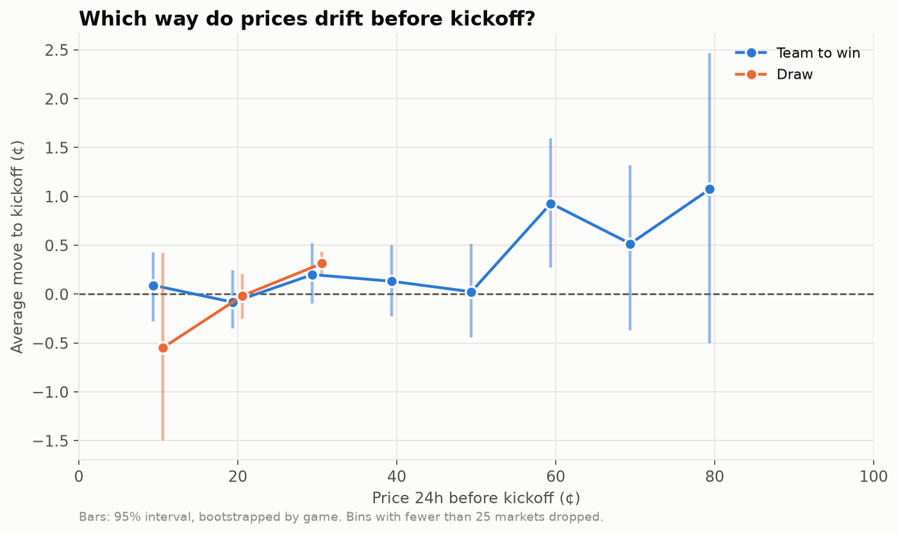

# Finding 03: How prices move before kickoff (all markets)

**Question:** every market's price moves between time t and kickoff (CLV). How big are the
moves, and which way do they go?
**Data:** 2,522 winner markets whose kickoff ESPN confirmed. Hourly bid/ask.
**Rebuild:** `python -m wc.research.kickoff`, then `python scripts/finding03_moves.py`.

## Step 0: kickoff times (ESPN = truth, Kalshi = check)

- Kalshi's `occurrence_datetime` is **kickoff + 3h**, not kickoff. It agrees with ESPN for 1,331 games.
- 137 games disagree (postponed games, or a few leagues where Kalshi uses a different offset). ESPN's time is kept for all of them.
- 710 games ESPN doesn't list (mostly the lower Brazilian and Italian divisions, China L1 and the Canadian league). They're left out rather than guessed.

## Step 1: how big is the move?

- Typical move from 24h before to kickoff: **1.5¢**. From 1h before: **0.5¢**.
- Buying at t and selling at kickoff costs **about 5–5.5¢**: half the spread on each side plus two fees.
- Only **8%** of markets move further than that cost.
- **So buying before kickoff and selling at kickoff doesn't pay for a taker**, even with perfect knowledge of the direction on most markets.

## Step 2: which way?

- **Favourites (60¢+) drift up about 1¢** before kickoff. 60–70¢ is the only price range whose interval excludes 0.
- Prices under 50¢: no drift.
- Draws: a slight upward tilt at 30¢, but inside the noise.

## What this means for the benchmark

- CLV still works as a **measure** of whether a strategy buys better prices than the market, but not as a strategy on its own.
- A usable edge from price direction alone looks like **about 1¢, on favourites, with early entry**. That's worth knowing when choosing **when** to buy a bet you'd hold to settlement anyway.
- **Next:** repeat on the droplet's full store (about 5× the markets), then test whether anything (Elo, form, bookmaker odds) predicts direction better than the price level alone.
