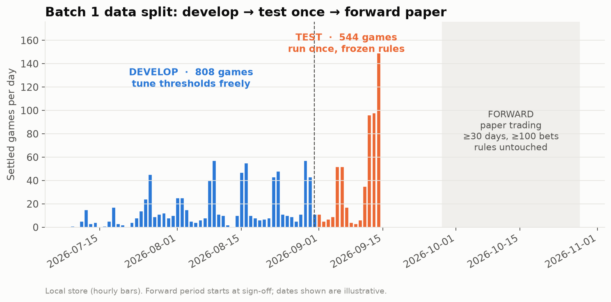

# Pre-registration: Batch 1 strategy tests

**Status: SIGNED OFF by Jack, 2026-09-28.** Nothing below has been run.
Rules, periods and pass criteria are fixed here **before** any test. The git commit that
freezes each rule is its timestamp. Changing a rule after its test has run means starting a new
pre-registration, not editing this one.

## Common to every test

| Item | Fixed value |
|---|---|
| Markets | Kalshi soccer `*GAME` legs, result yes/no (voids excluded), game has an ESPN kickoff (`kickoffs.status` ∈ agree / disagree / espn_only) |
| Prices | Hourly bars; a quote counts only if bid > 0, ask > 0 and spread ≤ 10¢ |
| Entry time | Last bar at or before **kickoff − 24h** (at most 6h stale), unless the test says otherwise |
| Size | 1 contract per signal. Results are reported per contract. |
| Taker fee | ceil(0.07 · p · (1−p) · 100) / 100 per contract |
| Maker fee | ceil(0.0175 · p · (1−p) · 100) / 100 per contract. **Check it against Kalshi's current schedule before #1 runs.** |
| **Develop** | Games closing through **2026-08-31** (808 settled). Thresholds may be tuned, but only within the ranges listed. |
| **Test** | Games closing **2026-09-01 → 09-14** (544 settled). Run **once**, with frozen values. |
| **Forward** | Paper trading from sign-off, ≥ 30 days **and** ≥ 100 bets per rule, rules untouched |
| Error bars | Bootstrap, resampling **whole games**, 2,000 draws, seed 0 |
| Several tests at once | 5 tests, so a test passes only if its **99%** interval (not 95%) is above 0 |
| Benchmarks | Doing nothing ($0); **random entry** (same number of bets, same times, random leg); buying every leg at the same time |

---

## #4 Three-way sum arbitrage, first

- **Question:** can all three legs of a game ever be bought for less than $1, after fees?
- **Rule:**
  - At every hourly bar before kickoff where all 3 legs have quotes:
    - **Buy set:** Σ YES asks + Σ taker fees < 100¢.
    - **Sell set:** Σ YES bids − Σ taker fees > 100¢.
- **Parameters:** none, so develop and test run together.
- **Report:**
  - % of games with a gap
  - cents per set
  - how many hours the gap lasts
- **Pass:** at least 1% of test games show a gap of ≥ 1¢ after fees.
- **If it fails:** conclude "no gap lasting an hour or more". Gaps that close within seconds are out of reach of hourly bars.

## #2 vs #7 Longshot direction: which way does the bias run?

- **#2 Sell longshots:** YES mid ≤ **T** at entry → buy **NO** at its ask (100 − YES bid), hold to settlement.
  - Develop may choose: T ∈ {5, 10, 15}¢; entry at 24h or 6h.
- **#7 Buy longshots:** copies Angelini et al. 2022 exactly, so **nothing is tuned**. Home YES ≤ 24¢ or away YES ≤ 14¢ → buy **YES** at the ask, hold.
- **Report:**
  - net ¢ per contract
  - return on capital
  - split by league (reported, not used for pass/fail)
- **Pass:** 99% interval above 0 on the test. They can't both pass: #2 passing means longshots are overpriced, #7 passing means underpriced, and neither passing means no bias.
- **Added 2026-09-28, before any develop run:**
  - thresholds are compared with the **mid** price
  - develop picks the **(T, entry)** pair with the highest average net ¢ per contract; ties go to more bets
  - the frozen pair is committed to `results/batch1_frozen.json` before `test` runs
  - random-entry benchmark: same games and entry bar, a random leg and side, bought at the ask
- **Power caveat:** about 1,900 bets are needed to detect a 1¢ edge. The local test period will be short of that, so a fail here means "not detected", not "not there".

## #3 Bookmaker value gap: needs your decision first

- **Step 0 result (already checked):** there is **no stored bookmaker odds history** (0 of 584 games in `soccer.db`). ESPN serves only **current** odds, so this can't be backtested from ESPN.
- **Options, your call:**
  - **(a) Forward only:** add ESPN odds to the droplet collector hourly and test from now. Free, but slow.
  - **(b) football-data.co.uk:** free historical **closing** odds, including some of Kalshi's leagues (Argentina, Brazil, MLS, China, Japan). Closing odds only, so entry is at kickoff, not at −24h.
  - **(c) A paid odds history API** (e.g. The Odds API historical). Pre-kickoff odds at the times we choose; costs money.
- **Rule once we have odds:**
  - p_book = bookmaker probability with the margin removed (normalized 1/odds).
  - Buy YES when Kalshi ask ≤ p_book − taker fee − **X**.
  - Develop chooses X ∈ {1, 2, 3, 5}¢.
- **Pass:** 99% interval above 0, **and** positive average CLV.

## #1 Maker orders: the fill model decides everything

- **Rule:**
  - At entry, for legs with mid ≥ **M**, place a buy order at the current YES bid (+ **O**).
  - The order stays open until kickoff; if it hasn't filled by then, no trade.
  - A filled order is held to settlement.
  - Develop may choose: M ∈ {50, 60}¢, O ∈ {0, 1}¢.
- **Fill model (cautious):**
  - Filled at our price only if a later bar before kickoff has a trade `low` **strictly below** our price.
  - Our order waits in line behind earlier orders at the same price, so a trade exactly at our price doesn't count.
  - **Check first:** confirm `backfill_candles.low` is the trade low, and how often it's empty.
- **Report:**
  - fill rate
  - net ¢ per filled contract (maker fee)
  - **adverse selection:** win rate of filled vs unfilled orders at the same starting price
- **Pass:** 99% interval above 0 on the test under the cautious fill model. A pass is **necessary but not sufficient**: #1 must also pass forward, because a model can't truly tell us what would have filled.

---

## Order and effort

| Order | Test | Effort | Blocked by |
|---|---|---|---|
| 1 | #4 Three-way sum | ~½ day | nothing |
| 2 | #2 vs #7 Longshots | ~1 day | nothing |
| 3 | #1 Maker | 2–3 days | fill-model check + fee check |
| 4 | #3 Bookmaker gap | 1–2 days + data | **odds source decision (a/b/c)** |

(#1 moved ahead of #3 because #3 is blocked on data.)

## How it will be run

- All four live in one module, `wc/research/batch1.py`, with tests (TDD, per the repo rules).
- Each rule is a function: `(bars, kickoff, result) → trades`.
- `develop` and `test` are separate CLI modes.
- **`test` refuses to run until its frozen values are committed in this file.**
- Output: one chart per test plus a short findings doc, pushed like Findings 01–04.

## Sign-off

- [x] Rules and ranges above are OK
- [x] Develop / test split (Aug 31) is OK
- [x] 99% intervals for passing are OK
- [x] #3 odds source: **(a) forward only**: collect ESPN odds hourly on the droplet from now on
- [x] Go for #4 first

Signed off 2026-09-28. Because #3 is forward only, it has no develop period to tune X in.
**Proposed, to confirm:** fix X = 3¢ (the middle of its range) before the forward clock starts.

**Results:** [06_BATCH1_RESULTS.md](06_BATCH1_RESULTS.md).
