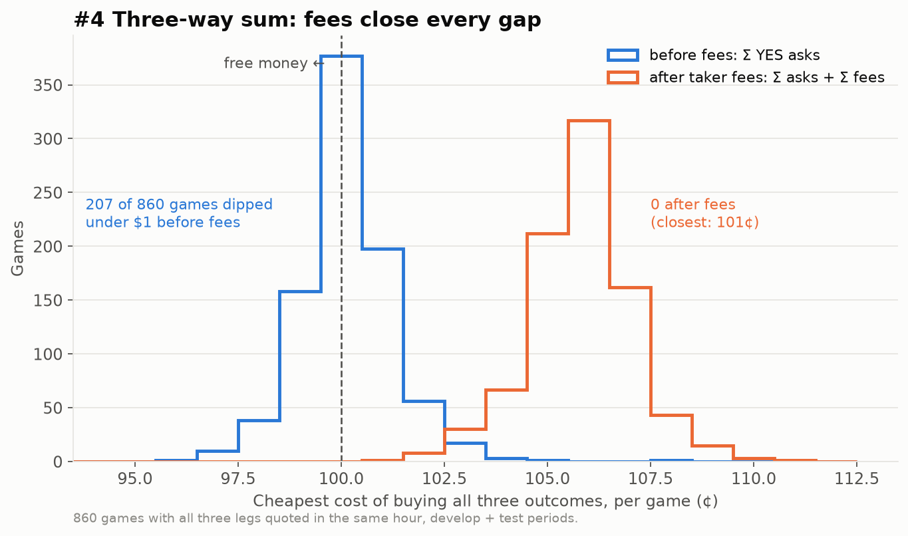

# Batch 1 results

Rules: [05_PREREG_BATCH1.md](05_PREREG_BATCH1.md) (signed off 2026-09-28).
Code: `wc/research/batch1.py`. Raw results: `results/*.json`.

| # | Test | Status | Verdict |
|---|---|---|---|
| 4 | Three-way sum | **done** | **FAIL:** no gap in 860 games |
| 2 vs 7 | Longshot direction | next | — |
| 1 | Maker orders | after that | — |
| 3 | Bookmaker gap | **paused** (Jack, 2026-09-28: no droplet deploy for now) | — |

## #4 Three-way sum: FAIL

- **0 of 860 games** had a gap after fees. Develop: 636 games (51,362 hourly checks). Test: 224 games (21,591 checks).
- **Before fees, 207 games (24%) dipped under $1**, by up to 4¢.
- **Taker fees add about 6¢** per set of three, so the cheapest any set ever cost was **$1.01**.
- **What it means:** no free money lasting an hour or more for a taker. Gaps that close within seconds can't be seen in hourly data.
- **Link to #1:** maker fees are about ¼ of taker fees. A maker who got filled on all three legs could capture some of those pre-fee gaps. The risk is getting filled on one or two legs but not all three.
- Rebuild: `python -m wc.research.batch1 three-way`, then `python scripts/batch1_charts.py`.
