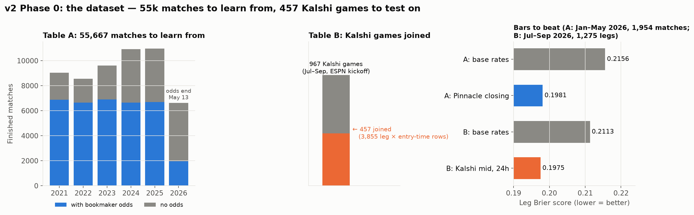

# Finding 08: v2 Phase 0 dataset (laptop data)

Branch `feat/v2-dataset`. Build: `python -m wc.research.dataset` (≈3 s), then
`python scripts/phase0_charts.py`. Plan: [NEXT_CHAPTER_v2.md](../NEXT_CHAPTER_v2.md).

## Table A: learn + practice exam ✅

- **55,667 finished matches, 2021 → Sep 2026:**
  - 54,254 from `soccer.db`
  - **+1,314 from the ESPN cache** and **+99 from Kalshi settlements**, filling Jun–Sep
- **35,693 carry bookmaker odds** until 2026-05-13, and they are **"96%+ Pinnacle closing"** (the data lake's own data dictionary). Pinnacle's last price before kickoff is the sharpest public price, so it's a **hard, honest bar**.
- Splits: train 38,099 · tune 10,958 · test 4,756 · Kalshi period 1,854.
- **23 point-in-time features**, rebuilt in one forward pass. 22 tests.

## Table B: final exam vs Kalshi ✅ (partial coverage)

- **457 of 967** Kalshi games join, which gives **3,855 rows** (leg × entry time of 24h / 6h / 1h), about 1,290 legs per entry time.
- **Sanity check:** every game has 3 distinct sides. 3 game-times lack the winning leg because it had no valid quote at 24h; nothing is mislabelled.
- **Still unmatched (510):** mostly leagues or teams `soccer.db` doesn't know (Bolivia, Chile, Paraguay, Belgium, 2. Bundesliga, ASEAN) or ambiguous names. The droplet store wouldn't fix this, because it's a team-history gap, not a price gap.

## How the gap was filled (data already on the laptop)

- **ESPN cache** (`data/espn_cache/`, 10,430 finished games, Jul 7 → Sep 29) is the main source, with goals.
  - Kalshi settles on **90 minutes**, so games that went to extra time or penalties count as **draws**, with goals unknown.
- **Kalshi settlements** are the fallback (home / draw / away, no goals).
- **Team names are resolved in pairs:** both teams must share a league they've played in. That tells apart the same name in different countries ("Nacional" in Uruguay vs Paraguay). Duplicates of `soccer.db` games (same teams within ±36h) are skipped.

## Bars to beat (leg Brier score, lower = better)

| Table | Period | Base rates | Market |
|---|---|---|---|
| A | Jan–May 2026, 1,954 matches | 0.2156 | **Pinnacle closing 0.1981** |
| B | Jul–Sep 2026, 1,275 legs at 24h | 0.2113 | **Kalshi mid 0.1975** |

- The two markets score about the same, on different games. A model must **beat, or add information to, prices that are this accurate.**

## Next: Phase 1 (baseline models)

- Train on Table A (2021–2024), tune on 2025, score on Jan–May 2026 against Pinnacle, and on Table B against Kalshi.
- Gate 2 (adds information?) is the one to watch.
