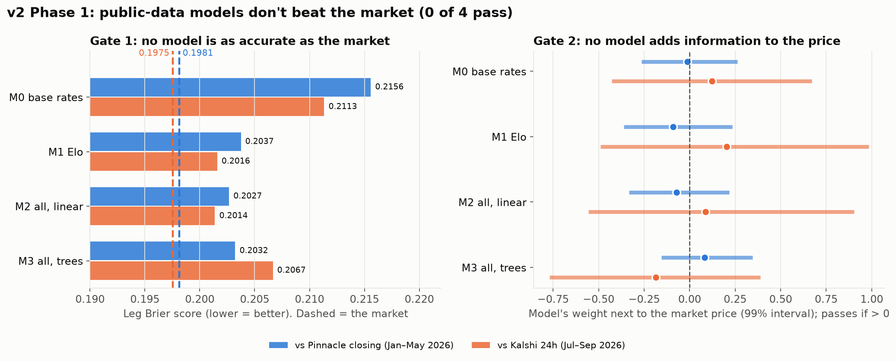

# Finding 09: v2 Phase 1 — baseline models vs the market

Branch `feat/v2-phase1`. Protocol fixed before training: [NEXT_CHAPTER_v2.md](../NEXT_CHAPTER_v2.md)
("Phase 1 protocol"). Run: `python -m wc.research.models` (~1 min), then
`python scripts/phase1_charts.py`. Raw numbers: `results/v2_phase1.json`.

**Result: 0 of 4 models pass either gate, on either table.**

| Model | Settings (picked on 2025) | Brier vs Pinnacle (Jan–May 2026) | Brier vs Kalshi 24h (Jul–Sep 2026) | Gate 2 |
|---|---|---|---|---|
| M0 base rates | — | 0.2156 vs **0.1981** | 0.2113 vs **0.1975** | ✗ |
| M1 Elo | — | 0.2037 | 0.2016 | ✗ |
| M2 all features, linear | C = 0.01 | **0.2027** | **0.2014** | ✗ |
| M3 all features, trees | lr 0.03, 15 leaves | 0.2032 | 0.2067 | ✗ |

## What it says

- **The features carry real information.** The best model improves on base rates by **0.013** of the 0.018 gap to Pinnacle, about 70% of the way.
- **The last 30% is what the market knows and we don't:** lineups, injuries, motivation, sharp money.
- **Gate 2: nothing left to add.** Next to the market price, every model's weight is about 0.
  - Against Pinnacle the intervals are narrow (±0.25), so this is a **confident no**.
  - Against Kalshi they're wide (±0.6–0.9) because Table B is small (about 1,290 legs): **not yet decidable**, but no hint of an edge.
- **Trees (M3) are no better than the linear model,** and worse on Kalshi. More model complexity isn't where an edge comes from.
- This is the same conclusion as Finding 07, now on 1,954 held-out matches against Pinnacle's closing prices: **public-data models don't beat, or add to, a sharp market.**

## Where an edge could still come from

1. **Information the price may not have yet:** earlier entry. Pinnacle *closing* is the hardest possible bar. Kalshi at 24h or earlier might not have absorbed everything, and Table B's intervals are too wide to rule that out.
2. **Thin markets** (Phase 2): split Gate 2 by league tier. The market may be sloppier in Bolivia than in the EPL.
3. **New information sources:** lineups, injuries, weather, or an LLM reading news. That would need new data collection, which is paused.
4. **A bigger Table B** (the droplet store) would narrow the Kalshi intervals enough to give a real answer.
