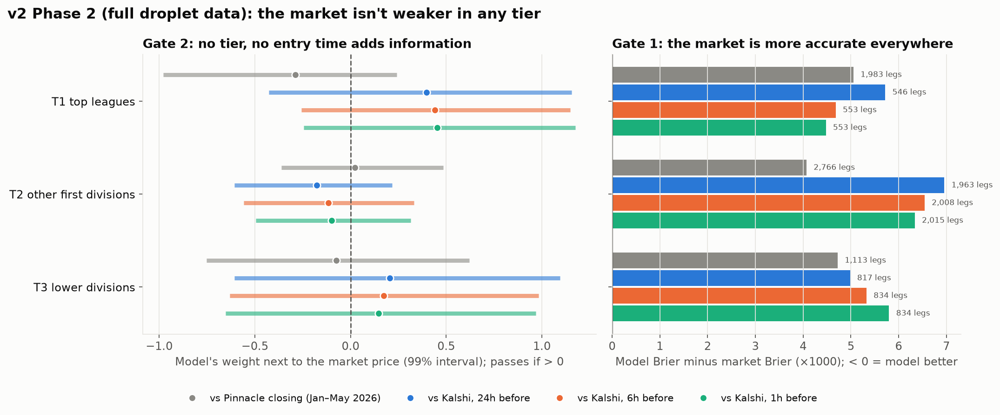

# Finding 10: v2 Phase 2 — is the market weaker anywhere? (full droplet data)

Protocol fixed before the run: [NEXT_CHAPTER_v2.md](../NEXT_CHAPTER_v2.md) ("Phase 2 protocol").
Ran on the droplet 2026-09-29, 23:24 → 23:52 UTC, via `scripts/run_phase2.sh`, on a
**snapshot** of the collector's database (the live file was only read). Results:
`results/v2_phase2.json`, `results/v2_phase0_droplet.json`, log `results/v2_phase2_run.log`.

**Result: no signal. 0 of 12 groups pass Gate 2, and the market is more accurate in all 12.**

## The bigger Kalshi test

| | Laptop (Phase 1) | Droplet (Phase 2) |
|---|---|---|
| Kalshi games with an ESPN kickoff | 967 | **4,648** |
| Joined to match history | 457 | **1,363** |
| Legs per entry time | ~1,290 | **~3,400** |
| Kalshi mid Brier at 24h | 0.1975 | 0.2031 |

## By tier (M2, C = 0.01 frozen)

| Group | Legs | Model − market Brier (×1000) | Gate 2 coefficient, 99% |
|---|---|---|---|
| T1 top, vs Pinnacle | 1,983 | +5.1 | −0.29 [−0.98, +0.24] |
| T1 top, vs Kalshi 24h / 6h / 1h | ~550 | +5.7 / +4.7 / +4.5 | **+0.40 / +0.44 / +0.45**, all intervals include 0 |
| T2 other first divisions, vs Pinnacle | 2,766 | +4.1 | +0.02 [−0.36, +0.49] |
| T2, vs Kalshi | ~2,000 | +7.0 / +6.6 / +6.4 | −0.18 / −0.12 / −0.10 |
| T3 lower divisions, vs Pinnacle | 1,113 | +4.7 | −0.07 [−0.75, +0.62] |
| T3, vs Kalshi | ~830 | +5.0 / +5.4 / +5.8 | +0.20 / +0.17 / +0.15 |

## What it says

- **Lower leagues aren't easier.** T3 looks the same as T1 and T2: the market beats the model and the model adds nothing.
- **Entry time doesn't matter:** 24h, 6h and 1h give the same answer. Kalshi's price barely moves before kickoff (Finding 03), so this is no surprise.
- **The one thing to watch, not a signal:**
  - T1 on Kalshi shows a coefficient of about +0.4 at all three entry times.
  - But the three entry times use **the same ~188 games**, so they aren't independent confirmations.
  - Every interval includes 0, and against Pinnacle the same tier is −0.29.
  - Under the protocol this is **no signal**.
- **Conclusion for v2:** with public data (Elo, form, goals, shots, head-to-head, league rates), a model **does not beat or add to** Kalshi or Pinnacle, in any tier, at any entry time.

## What's left

1. **New information the market may not price quickly:** lineups, injuries, news, possibly read by an LLM. That needs new data collection, which is paused.
2. **Stop here:** write up v2 as "public-data models don't beat this market", in the same way as v1.0.
